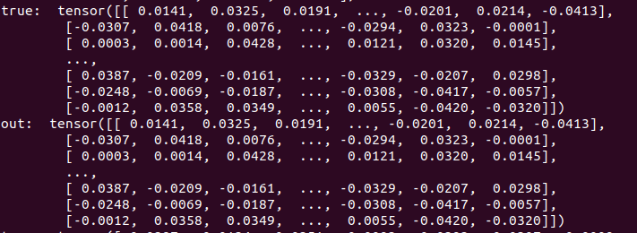

To use the code, run <b>python main.py</b> and check the configuration options in config.py

**Octopy** is an efficient framework for parallel simulation of Federated Learning atop Pytorch.
<a href="https://www.meng-dong.me/Octopy/">Visit our website</a>

